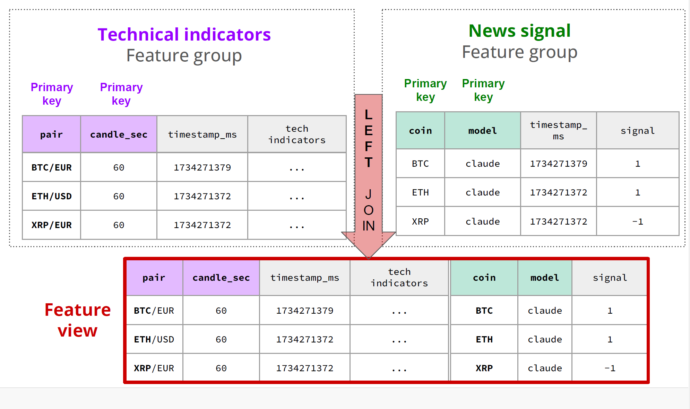

# Price Predictor

Feature Views
https://docs.hopsworks.ai/4.1/concepts/fs/feature_view/fv_overview/

This will create a view from our join of Technical Indicators and News Signal

Training pipeline example
https://github.com/logicalclocks/hopsworks-tutorials/blob/master/fraud_online/2_fraud_online_training_pipeline.ipynb

When we return the target in the df_all dataframe, the first timestamp in target is equal to the position 5 in the close column (60 *5 = 300 seconds). We shift in time to predict.
